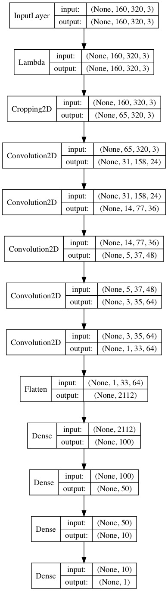
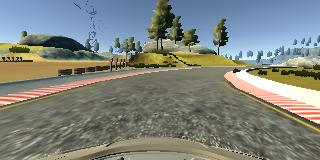
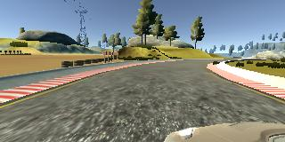
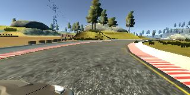
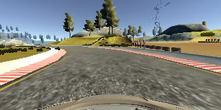
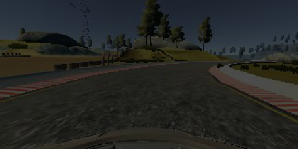
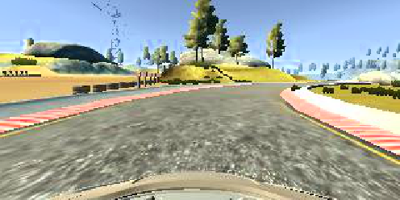
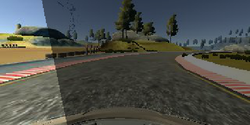
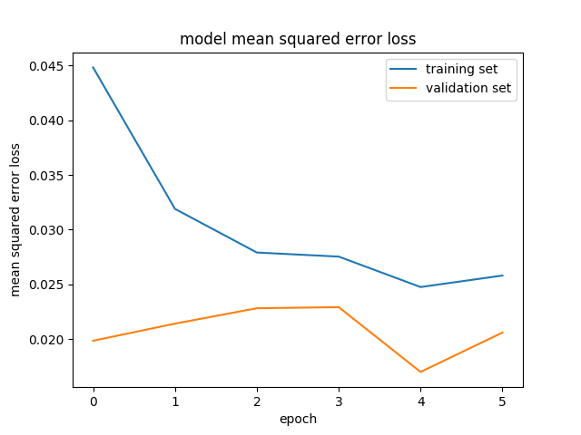

# **Behavioral Cloning** 

## Writeup

---

**Behavioral Cloning Project**

The goals / steps of this project are the following:
* Use the simulator to collect data of good driving behavior
* Build, a convolution neural network in Keras that predicts steering angles from images
* Train and validate the model with a training and validation set
* Test that the model successfully drives around track one without leaving the road
* Summarize the results with a written report


## Rubric Points
###Here I will consider the [rubric points](https://review.udacity.com/#!/rubrics/432/view) individually and describe how I addressed each point in my implementation.  

---
### Files Submitted & Code Quality

#### 1. Submission includes all required files and can be used to run the simulator in autonomous mode

My project includes the following files:
* model.py containing the script to create and train the model
* drive.py for driving the car in autonomous mode
* model.h5 containing a trained convolution neural network 
* writeup_report.md summarizing the results
* video.mp4 showing the vehicle driving autonomously around the first track for one full lap

#### 2. Submission includes functional code
Using the Udacity provided simulator and my drive.py file, the car can be driven autonomously around the track one by executing 
```sh
python drive.py model.h5
```

#### 3. Submission code is usable and readable

The model.py file contains the code for training and saving the convolution neural network. The file shows the pipeline I used for training and validating the model, and it contains comments to explain how the code works.

### Model Architecture and Training Strategy

#### 1. An appropriate model architecture has been employed

My model consists of a convolution neural network with 5x5 and 3x3 filter sizes and depths between 24 and 64. It is the model name _Nvidia_model_ in the __model.py__ file.

```python
def Nvidia_model():
	model = model_preprocessing()
	model.add(Convolution2D(24, 5, 5, subsample=(2,2), activation='relu'))
	model.add(Convolution2D(36, 5, 5, subsample=(2,2), activation='relu'))
	model.add(Convolution2D(48, 5, 5, subsample=(2,2), activation='relu'))
	model.add(Convolution2D(64, 3, 3, activation='relu'))
	model.add(Convolution2D(64, 3, 3, activation='relu'))
	model.add(Flatten())
	model.add(Dense(100))
	model.add(Dense(50))
	model.add(Dense(10))
	model.add(Dense(1))
	return model
```

The model includes RELU layers to introduce nonlinearity, and the data is normalized in the model using a Keras lambda layer. 

```python
def model_preprocessing():
	"""
	Preprossing step common to all the Keras models
	Normalization of the images
	Cropping of the images
	"""
	model = Sequential()
	model.add(Lambda(lambda x: (x / 255.0) - 0.5, input_shape=(160,320,3)))
	# crop to take out sky and hood
	model.add(Cropping2D(cropping=((TOP_CROP, BOT_CROP), (0,0))))
	return model
```

#### 2. Attempts to reduce overfitting in the model

Some attempts have been made to add Dropout in my model, but with bad results. As I was able to have good results by training my model without using Dropout, I finally didn't use them. The Data Selection (explained below) and the Image Augmentation (explained below) helped the model not to overfit by themselves.

The model was tested by running it through the simulator and ensuring that the vehicle could stay on the track.

#### 3. Model parameter tuning

The model used an adam optimizer, so it wasn't necessary to manually tune the learning rate (__model.py__ line 356).

#### 4. Loss function

I used mean squared error for the loss function to measure how close the model predicts to the given steering angle for each image (__model.py__ line 356).

#### 5. Appropriate training data

Training data was chosen to keep the vehicle driving on the road. I used a combination of center lane driving, and recovering from the left and right sides of the road simulated thanks to the left and right camera and corresponding appropriated factor added to the steering angle.

I only used the training data provided by Udacity.

For details about how I created the training data, see the next section. 

### Model Architecture and Training Strategy

#### 1. Solution Design Approach

The overall strategy for deriving a model architecture was to try known architectures.

I tried these different architectures : LeNet, Nvidia and Comma.ai

My first step was to use a convolution neural network model similar to the LeNet model, as done in the Udacity lesson. It was a start, but the results weren't so good.

I then implemented the Nvidia model described in the paper [End to End Learning for Self-Driving Cars](https://arxiv.org/pdf/1604.07316v1.pdf).

I also tried the Comma.ai model.

In order to gauge how well the model was working, I split my image and steering angle data into a training and validation set. I found that my first model had a low mean squared error on the training set but a high mean squared error on the validation set. This implied that the model was overfitting. 

The final step was to run the simulator to see how well the car was driving around track one. There were a few spots where the vehicle fell off the track. To improve the driving behavior in these cases and combat overfitting, I augmented the provided data by applying modifications on the images, and have not used all the sample images, by dropping some "straight line" samples (different drop at each epoch), as explained below.

At the end of the process, the vehicle is able to drive autonomously around the track without leaving the road.

#### 2. Final Model Architecture

The final model architecture is present in __model.py__ at lines 248-260).

Here is a visualization of the architecture used, it consistes of a convolution neural network  that is the Nvidia architecture described in the paper [End to End Learning for Self-Driving Cars](https://arxiv.org/pdf/1604.07316v1.pdf) :



#### 3. Creation of the Training Set & Training Process

##### Training images

To capture good driving behavior, I just used the data provided by Udacity, that has been recorded on track one.

 Here is an example image of center lane driving :



I didn't need to record the vehicle recovering from the left side and right sides of the road back to center so that the vehicle would learn to recover from car going out of road, as I used the left and right camera images to simulate these events. 

I therefore used  the images of the center camera, but also those of the left and right cameras with adapted steering angles (set to 0.25), to similate recovering of the left and right sides.

Here is the image of the left camera corresponding to the same sample : 



And the one of the right camera :



I didn't get any additional data by driving the car, on track 1 or 2.

##### Training and validation sets

I randomly shuffled the data set and put 20% of the data into a validation set. 

##### Data selection

I dropped at random 70% of the "straight line" samples of the training set, as they are over-represented in the dataset, and it could over-train the model to drive straight.

The random dropped "straight line" samples are different for each epoch, so that we do not use too much of them for training the model, but do not definitively throw some of them. The drop is done using a Keras generator, at the same time as the augmentation.

A "straight line" sample has been defined by an absolute value of the steering angle inferior to 0.05.

##### Augmentation

For training (and only for training), I used the following augmentation techniques along with the Keras generator to generate unlimited number of images.

First, I randomly selected center, left or right image for each sample. For left image, steering angle is adjusted by adding 0.25 to it. For right image, steering angle is adjusted by adding -0.25 to it.

Here are the operations I applied on the images :

* Horizontal flip (to simulate opposite steering direction, and to equalize the dataset that has more left turns than right turn, seeing the track is circular and the data is coming from that car having been driven only in one direction of the track). Changing the sign of the steering angle at the same time.



* Random brightness (ligher or darker, to simulate less or more shiny day, shadows when driving in woods,…) (BEWARE : I didn't put a threshold on the value and then when the image was more bright and the value was up 255, I overflowed and was getting bad images. Now that I put a a threshold of 255 on the value, I get good images and better results)





* Random projected shadow (to simulate shadows on the road)



I could also have used (suggested improvements) :

* Noise (to simulate bad quality acquired images)
* Random horizontal translation (to simulate car being more on left or right of the road, with appropriate steering angle adjustment)
* Random vertical translation (to simulate car going up or down hill)
* Gaussian blur


##### Pre-processing

After the collection process and the data selection, I had 3377 samples of car driving. 

I then preprocessed this data (as well as validation and inference data) by :

* Converting the images from RGB to YUV


* Normalizing it with a Keras lamba layer, so that it is mean centered and between -0.5 and 0.5
* Cropping it, so that the hood of the car on the bottom of the image and the landscape up the horizon don't appear on the final image


The normalizing and cropping operations are inserted in the Keras model, so that it isn't needed to edit the drive.py file to add these operations (but it is needed for the YUV conversion).

##### Training

I used this training data for training the model. The validation set helped determine if the model was over or under fitting. The ideal number of epochs was 5 as evidenced by the plot of the losses. (As I saved checkpoints for each of the epoch, I was able to use the model corresponding to the fifth epoch, even if I trained for 6 epochs)



I used ModelCheckpoint from Keras to save the model at each epoch.
